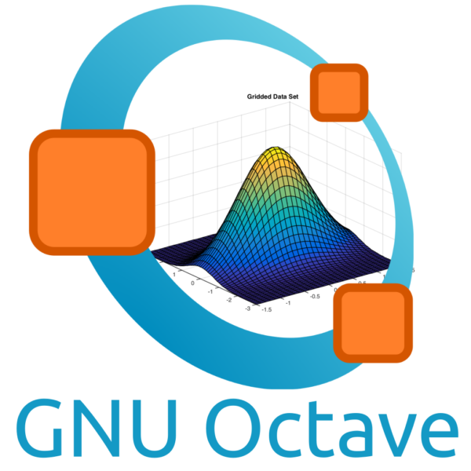

# Carlos Corredor
### Full Stack Developer
#### Ingeniería Geofísica
#### Electrónica

---

Después de 25 años enseñando matemáticas, física, redes eléctricas e instrumentación geofísica, ahora me dedico al apasionante mundo de la programación como desarrollador web en las siguientes tecnologías: Javascript, React, Redux, Sass, Less, Node, Express, MongoDB, Mongoose, PostgreSQL, Sequelize.

---
## Contacto

<!-- <a href="https://www.linkedin.com/in/carlos-corredor-78b273189/"  title="Linkedin"> -->

<!--  
<a src="https://t.me/carloscorredorwg" style="text-decoration: none; cursor: pointer;">
  Telegram
</a>
<a src="http://gmail.com" style="text-decoration: none; cursor: pointer;">
  Email
</a>
<a src="https://www.linkedin.com/in/carlos-corredor-78b273189/" style="text-decoration: none; cursor: pointer;">
  Linkedin
</a> -->
 
<!-- #### [Telegram](https://t.me/carloscorredorwg)
#### [Email](http://gmail.com)
#### [LinkedIn](https://www.linkedin.com/in/carlos-corredor-78b273189/) -->

---
## Tecnologías
### Client side:
 
<!-- #### Html  -->

<!-- `HTML`
`CSS`
`JavaScript`
`Sass`
`Less`
`jQuery`
`TDD (Vanilla JS and Jasmine)`
`External API's`
`ReactJS`
`Redux` -->
HTML
CSS
JavaScript
Sass
Less
jQuery
TDD (Vanilla JS and Jasmine)
External API's
ReactJS
Redux
 
 

 
 
 
 
 
 
 
 

### Server side:
 

NodeJS
ExpressJS
Server-side rendering with PUG
MongoDB
PostgreSQL
TDD (Mocha, Chai, NYC & Istanbul)
 
 

 
 
 
 
 
 
 ###    Team working:
 

Scrum
Agile
Git
Trello
<!-- Slack -->
 
 

 
 
 <!--  -->

  ###    Otros:
 

Octave
 
 
 

---
## Proyectos
<!-- ### [Food calendar](https://github.com/AgustinKowalczuk/PG-FoodCalendar/tree/CopiaSeguridad")
### [Dogs](https://github.com/Carlos7979/PI-Dogs-FT15a) -->
<ul>
  <li><a href="https://github.com/Carlos7979/vue-project" target="_blank">Vue Bakery</a></li>
  <li><a href="https://github.com/AgustinKowalczuk/PG-FoodCalendar/tree/CopiaSeguridad" target="_blank">Food calendar</a></li>
  <li><a href="https://github.com/Carlos7979/PI-Dogs-FT15a" target="_blank">Dogs</a></li>
  <li><a href="https://github.com/Carlos7979/cf-mce/tree/develop" target="_blank">Control de flujos de módulos de control electrónicos</a></li>
  <li><a href="https://github.com/Carlos7979/skylab-bootcamp-201904/tree/develop/staff/groups/nozama/nozama-app" target="_blank">E-commerce Nozama</a></li>
  <li><a href="https://github.com/Carlos7979/check-list/tree/develop" target="_blank">Agenda del día</a></li>
</ul>

---
## [CV](./downloads/Carlos-Corredor-CV.pdf)

<!--
**Carlos7979/Carlos7979** is a ✨ _special_ ✨ repository because its `README.md` (this file) appears on your GitHub profile.

Here are some ideas to get you started:

- 🔭 I’m currently working on ...
- 🌱 I’m currently learning ...
- 👯 I’m looking to collaborate on ...
- 🤔 I’m looking for help with ...
- 💬 Ask me about ...
- 📫 How to reach me: ...
- 😄 Pronouns: ...
- ⚡ Fun fact: ...
-->
